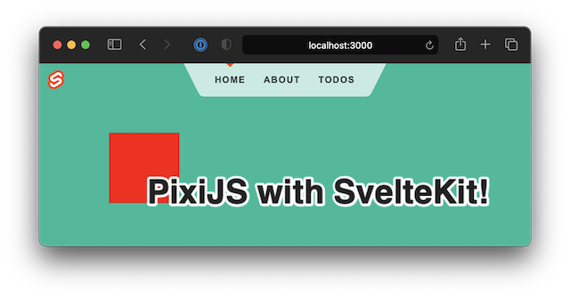

## This is a full example illustrating the use of [@mszu/pixi-ssr-shim](https://www.npmjs.com/package/@mszu/pixi-ssr-shim)



This repository contains the default SvelteKit hello-world app with the
`src/routes/index.svelte` component modified to include a PixiJS Application.

Also note the addition to `svelte.config.js`:
```javascript
/** @type {import('@sveltejs/kit').Config} */
const config = {
  kit: {
    // hydrate the <div id="svelte"> element in src/app.html
    target: '#svelte',
    vite: {                               // <--
      optimizeDeps: {                     // <--
        include: ['url', 'querystring']   // <-- This fixes "import not found: resolve" issues
      }                                   // <-- stemming from @pixi/utils importing 'url'
    }                                     // <--
  }
};
export default config;
```

Run with `npm run dev` for the dev server, or `npm run build` then `npm run preview`
for the production build preview.

See original README below

----------------------------------------------------------

# create-svelte

Everything you need to build a Svelte project, powered by [`create-svelte`](https://github.com/sveltejs/kit/tree/master/packages/create-svelte);

## Creating a project

If you're seeing this, you've probably already done this step. Congrats!

```bash
# create a new project in the current directory
npm init svelte@next

# create a new project in my-app
npm init svelte@next my-app
```

> Note: the `@next` is temporary

## Developing

Once you've created a project and installed dependencies with `npm install` (or `pnpm install` or `yarn`), start a development server:

```bash
npm run dev

# or start the server and open the app in a new browser tab
npm run dev -- --open
```

## Building

Before creating a production version of your app, install an [adapter](https://kit.svelte.dev/docs#adapters) for your target environment. Then:

```bash
npm run build
```

> You can preview the built app with `npm run preview`, regardless of whether you installed an adapter. This should _not_ be used to serve your app in production.
